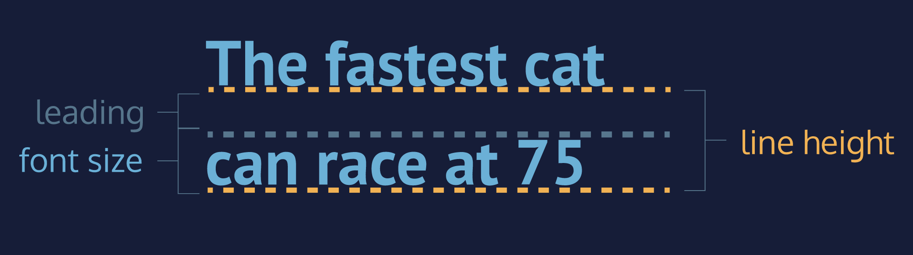
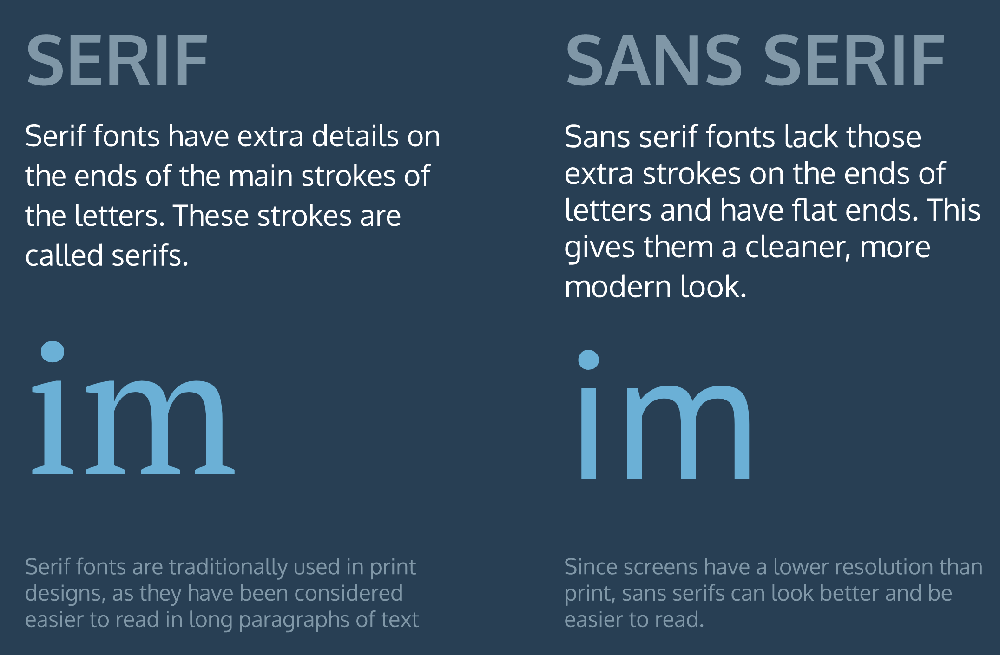

# CSS Typography

## Table of Contents

- [Typography](#Typography)
- [Font Family](#Font-Family)
- [Font Weight](#Font-Weight)
- [Font-Style](#Font-Style)
- [Word Spacing](#Word-Spacing)
- [Letter Spacing](#Letter-Spacing)
- [Text Transformation](#Text Transformation)
- [Text Alignment](#Text-Alignment)
- [Line Height Anatomy](#Line-Height-Anatomy)
- [Line Height](#Line-Height)
- [Serif and Sans Serif](#Serif-and-Sans-Serif)
- [Fallback Fonts](#Fallback-Fonts)
- [Linking Fonts](#Linking-Fonts)
- [Font-Face](#Font-Face)
- [Review](#Review)


## Typography

Now we will focus on *typography*, the art of arranging text on a page. In particular, we will look at how to style fonts with CSS to make them legible and appealing and how to add external fonts to your web pages.

Some of the most important information a user will see on a web page will be textual. Styling text to make page content accessible and engaging can significantly improve user experience. 


## Font Family

When we a formatted word processor, we sometimes used a feature that allowed us tochange the “type of font” we were typing in. The phrase “type of font” refers to the technical term [typeface](https://en.wikipedia.org/wiki/Typeface), or *font family*.

To change the typeface of text on our web page, we can use the `font-family` property.

```css
h1 {
  font-family: Garamond;
}
```

In the example above, the font family for all main heading elements has been set to `Garamond`.

When setting typefaces on a web page, keep the following points in mind:

1. The font specified in a stylesheet must be installed on a user’s computer in order for that font to display when a user visit the web page. 
2. The default typeface for many browsers is [Times New Roman](https://en.wikipedia.org/wiki/Times_New_Roman). 
3. It is a good practice to limit the number of typefaces used on a web page to 2 or 3.
4. When the name of a typeface consists of more than one word, it must be enclosed in double quotes (otherwise it will not be recognized), like so:

```css
h1 {
  font-family: "Courier New";
}
```


## Font Weight

It is common to **bold** important headings or keywords. In CSS, we can style bold text with the `font-weight` property.

If we want to `bold` text in a web page, we can set the `font-weight` to `bold`.

```css
p {
  font-weight: bold;
}
```

If we want to ensure that text is not bold, we can set the `font-weight` to `normal`.

```css
p {
  font-weight: normal;
}
```

By default, the `font-weight` of most text elements is set to `normal`. Some elements, like headers, have built-in bold styling. A good approach is to check to see if the text element has any default styling, and use the `font-weight` property accordingly.


The `font-weight` property can also be assigned a number value to style text on a numeric scale ranging from 100 to 900. Valid values are multiples of 100 within this range such as `200` or `500`.

When using numeric weights, there are a number of default font weights that we can use:

1. `400` is the default `font-weight` of most text.
2. `700` signifies a bold `font-weight`.
3. `300` signifies a light `font-weight`.

Let’s take a look at an example of how numeric fonts are used.

```css
header {
  font-weight: 800;
}
 
footer {
  font-weight: 200;
}
```

Here, the header would appear as a deep bold, while the footer would appear rather light.

It is important to note that not all fonts can be assigned a numeric `font-weight`. You can look up the font you are using to see which `font-weight` values are available.


## Font Style

We can also italicize text with the `font-style` property.

```css
h3 {
  font-style: italic;
}
```

The `italic` value causes text to appear in italics. The `font-style` property also has a `normal` value which is the default.


## Word Spacing

We can also increase the spacing between words in a body of text, technically known as *word spacing*.

To do so, we can use the `word-spacing` property:

```css
h1 {
  word-spacing: 0.3em;
}
```

Note that it is good to use [`em` values](https://developer.mozilla.org/en-US/docs/Web/CSS/font-size#Ems) in this case because `em` is dynamic — for word spacing, it sets the spacing based on the size of the font. In the example above, the word spacing is set to `0.3em`. The default amount of space between words is usually `0.25em` and can be set with the value `normal`. If we provide a value for `word-spacing` that is **not** `normal`, then the value we provide is **added** to the default spacing. Therefore, since the `word-spacing` is set to `0.3em`, our `<h1>` elements get a total of `0.55em` word spacing when rendered.

It is not common to increase the spacing between words, but it may help enhance the readability of bolded or enlarged text.


## Letter Spacing

We have seen how to increase the spacing between lines of text and words, but it is possible to get even more detailed: increasing the spacing between individual letters.

The technical term for adjusting the spacing between letters is called *tracking*. Tracking can be adjusted with the `letter-spacing` property in CSS.

```css
h1 {
  letter-spacing: 0.3em;
}
```

Like word spacing, it is not common to increase the tracking in text, but sometimes it enhances the readability of uppercase text.


## Text Transformation

Text can also be styled to appear in either all uppercase or lowercase with the `text-transform` property.

```css
h1 {
  text-transform: uppercase;
}
```

The code in the example above formats all `<h1>` elements to appear in `uppercase`, regardless of the case used for the heading within the HTML code. Alternatively, the `lowercase` value could be used to format text in all lowercase.

Since text can be directly typed in all uppercase or lowercase within an HTML file, what is the point of a CSS rule that allows us to format [letter case](https://en.wikipedia.org/wiki/Letter_case)?

Depending on the type of content a web page displays, it may make sense to always style a specific element in all uppercase or lowercase letters. For example, a website that reports breaking news may decide to format all `<h1>` heading elements such that they always appear in all uppercase, as in the example above. It would also avoid uppercase text in the HTML file, which could make code difficult to read.


## Text Alignment

No matter how much styling is applied to text (typeface, size, weight, etc.), text always appears on the left side of the browser.

To move, or align, text, we can use the `text-align` property.

```css
h1 {
  text-align: right;
}
```

The `text-align` property can be set to one of the following three values:

1. `left` - aligns text to the left hand side of the browser.
2. `center` - centers text.
3. `right` - aligns text to the right hand side of the browser.

Later we will see exactly how the browser positions HTML elements by default, which will help us understand how the browser “aligns” text, since “align” is a relative term. For now, it is enough to know that text can be moved to the left, center, or right side of the web page.


## Line Height Anatomy

Another property that we can set for text is `line-height`. This property modifies the *leading* of text.

The diagram below helps illustrate exactly what the terms “leading” and “line height” mean.




## Line Height

We often modify `line-height` to make text on a web page easier to read. When text is styled to appear larger, the vertical spacing between lines of text can decrease, creating text that is difficult to read, particularly in paragraphs.

We can use the `line-height` property to set how tall we want the line containing our text to be, regardless of the height of the text. Line heights can take one of several values:

1. A unitless number, such as `1.2`. This number is an absolute value that will compute the line height as a ratio of the font size.
2. A number specified by unit, such as `12px`. This number can be any valid CSS unit, such as pixels, percents, ems, or rems.

Generally, the unitless ratio value is the preferred method, since it is responsive and based exclusively on the current font size. In other words, if we change the font size, a unitless `line-height` would automatically readjust, whereas the pixel value would remain static.

```css
p {
  line-height: 1.4;
}
```


## Serif and Sans Serif

Now let's set some text to be *serif* and some text to be *sans-serif*. 

1. Serif — fonts that have extra details on the ends of each letter. Examples include fonts like Times New Roman or Georgia, among others.
2. Sans-Serif — fonts that do not have extra details on the ends of each letter. Instead, letters have straight, flat edges, like Arial or Helvetica.




## Fallback Fonts

What happens when a stylesheet requires a font that is not installed on a user’s computer? Most computers have a small set of typefaces pre-installed. This small set includes serif fonts like Times New Roman and sans-serif fonts like Arial.

These pre-installed fonts serve as *fallback fonts* if the stylesheet specifies a font which is not installed on a user’s computer.

To use fallback fonts, the following syntax is required:

```css
h1 {
  font-family: "Garamond", "Times", serif;
}
```

The CSS rule above says:

1. Use the Garamond font for all `<h1>` elements on the web page.
2. If Garamond is not available, use the Times font.
3. If Garamond and Times are not available, use any serif font pre-installed on the user’s computer.

The fonts specified after Garamond are the fallback fonts (`Times`, `serif`). Fallback fonts help ensure a consistent experience for the diverse audience of users that visit a site.


## Linking Fonts

With the number of fonts available with modern typography, it is unrealistic to expect users to have all fonts installed on their computers. New fonts are often centralized in directories made available for public use. We refer to these fonts as *non-user fonts*.

[Google Fonts](https://fonts.google.com/) is one such directory of thousands of open-source fonts, available for free use. Google Fonts gives us a way to retrieve the link for a single font, multiple fonts, or multiple fonts with the `font-weight` and `font-style` properties.


When we have the link to the font and the styles of our choice, we can add the font to the `<head>` section of the HTML document, using the `<link>` tag and the `href` property.

Let’s take a look at a few examples:

1. A single linked font, using `Open Sans` as an example:

   ```html
   <head>
     <link href="https://fonts.googleapis.com/css2?family=Open+Sans" rel="stylesheet">
   </head>
   ```

2. Multiple linked fonts, using the `Open Sans` and `Playfair Display` fonts as an example:

   ```html
   <head>
     <link href="https://fonts.googleapis.com/css2?family=Open+Sans&family=Playfair+Display" rel="stylesheet">
   </head>
   ```

3. Multiple linked fonts, along with weights and styles. Here `Open Sans` has font weights of `400`, `700`, and `700i`, while `Playfair Display` has font weights of `400`, `700`, and `900i`:

   ```html
   <head>
     <link href="https://fonts.googleapis.com/css2?family=Open+Sans:ital,wght@0,400;0,700;1,700&family=Playfair+Display:ital,wght@0,400;0,700;1,900" rel="stylesheet">
   </head>
   ```

Once a font is linked, we can create CSS selectors to target elements, just as we do with other fonts.


## Font-Face

There are other ways to link non-user fonts that do not require the use of the `<link>` tag in the HTML document. CSS offers a way to import fonts directly into stylesheets with the `@font-face` property.

To load fonts with the `@font-face` property:

1. Instead of using the font’s link in the HTML document, enter the link into the URL bar in the browser.
2. The browser will load the CSS rules. We will need to focus on the rules that are directly labeled as `/* latin */`. Some of the latin rules are on separate lines. 
3. Copy each of the CSS rules labeled latin, and paste the rules from the browser to the top of **style.css**.

It is important to stress the need to copy the `@font-face` rules to the top of the stylesheet for the font to load correctly in the project. 


While Google Fonts and other resources can broaden font selection, we may wish to use an entirely different font or abstain from using a font from an external service.

We can modify our `@font-face` rule to use local font files as well. We can supply the user with the desired font family and host it along with our site instead of depending on a different site.

```css
@font-face {
  font-family: "Roboto";
  src: url(fonts/Roboto.woff2) format('woff2'),
       url(fonts/Roboto.woff) format('woff'),
       url(fonts/Roboto.tff) format('truetype');
}
```

Here:

1. The main difference is the use of a relative filepath instead of a web URL.
2. We add a format for each file to specify which font to use. Different browsers support different font types, so providing multiple font file options will support more browsers.

As of now `.woff2` appears to be the way of the future, due to greatly reduced file sizes and improved performance, but many browsers still do not support it. There are lots of great sources to find fonts to use locally, such as [Font Squirrel](https://www.fontsquirrel.com/).


## Review

- *Typography* is the art of arranging text on a page.
- Text can appear in any number of weights, with the `font-weight` property.
- Text can appear in italics with the `font-style` property.
- The vertical spacing between lines of text can be modified with the `line-height` property.
- *Serif* fonts have extra details on the ends of each letter. *Sans-Serif* fonts do not.
- *Fallback fonts* are used when a certain font is not installed on a user’s computer.
- Google Fonts provides free fonts that can be used in an HTML file with the `<link>` tag or the `@font-face` property.
- Local fonts can be added to a document with the `@font-face` property and the path to the font’s source.
- The `word-spacing` property changes how far apart individual words are.
- The `letter-spacing` property changes how far apart individual letters are.
- The `text-align` property changes the horizontal alignment of text.