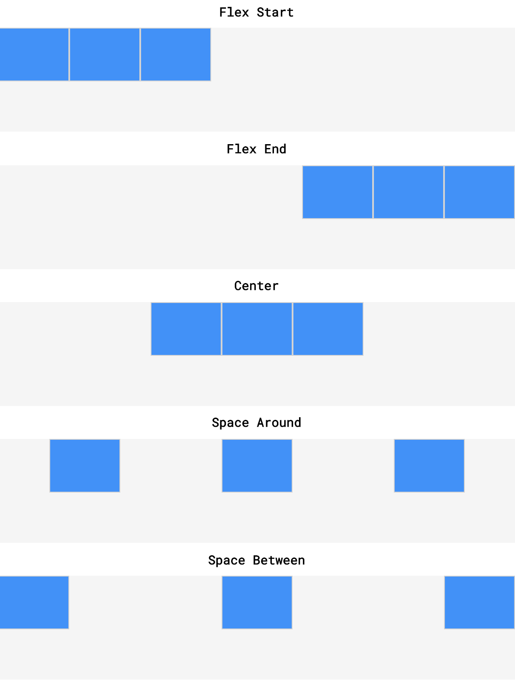
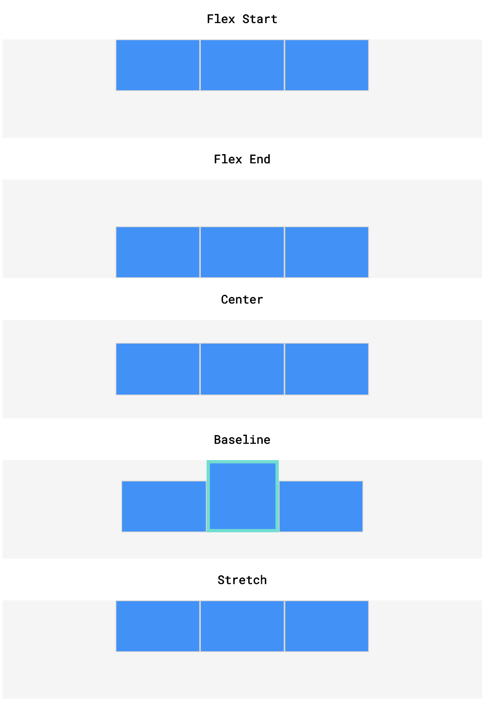
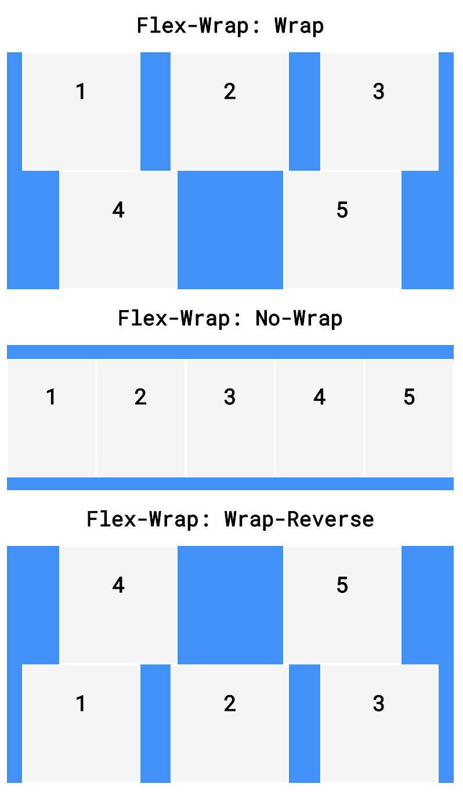
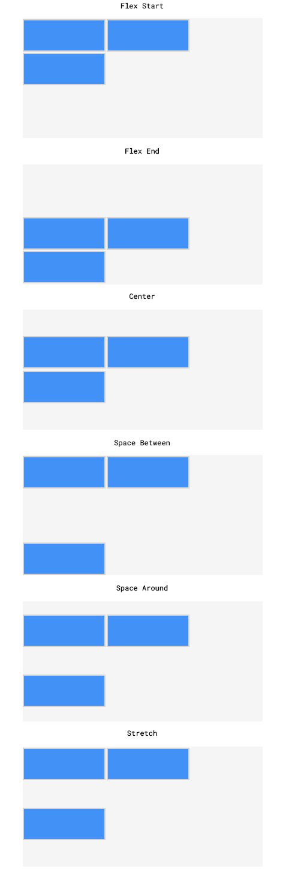
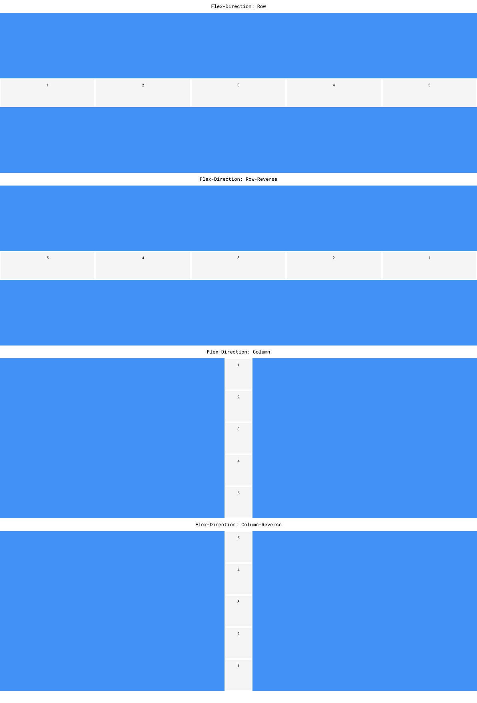

# Flexbox

## Table of Contents

- [What is Flexbox?](#What-is-Flexbox)
- [display: flex](#display-flex)
- [inline-flex](#inline-flex)
- [justify-content](#justify-content)
- [align-items](#align-items)
- [flex-grow](#flex-grow)
- [flex-shrink](#flex-shrink)
- [flex-basis](#flex-basis)
- [flex](#flex)
- [flex-wrap](#flex-wrap)
- [Align-content](#Align-content)
- [flex-direction](#flex-direction)
- [flex-flow](#flex-flow)
- [Nested Flexboxes](#Nested-Flexboxes)
- [Review: Flexbox](#Review-Flexbox)


## What is Flexbox?

CSS provides many tools and properties that you can use to position elements on a webpage. 

Now we will learn about *flexbox* or Flexible Box Layout, a new tool developed for CSS3 that greatly simplifies how to position elements. While flexbox is not meant to lay out entire pages, it is useful for positioning elements, whether individually or in groups.

There are two important components to a flexbox layout: *flex containers* and *flex items*. A flex container is an element on a page that contains flex items. All direct child elements of a flex container are flex items. This distinction is important because some of the properties we learn here apply to flex containers while others apply to flex items.

To designate an element as a flex container, set the element’s `display` property to `flex` or `inline-flex`. Once an item is a flex container, there are several properties we can use to specify how its children behave. Here we will cover these properties:

1. `justify-content`
2. `align-items`
3. `flex-grow`
4. `flex-shrink`
5. `flex-basis`
6. `flex`
7. `flex-wrap`
8. `align-content`
9. `flex-direction`
10. `flex-flow`

Flexbox is an elegant tool that makes it easy to address positioning issues that may have been difficult before. 


## display: flex

Any element can be a flex container. Flex containers are helpful tools for creating websites that respond to changes in screen sizes. Child elements of flex containers will change size and location in response to the size and position of their parent container.

For an element to become a flex container, its `display` property must be set to `flex`.

```css
div.container {
  display: flex;
}
```

In the example above, all divs with the class `container` are flex containers. If they have children, the children are flex items. A div with the declaration `display: flex;` will remain block level — no other elements will appear on the same line as it.

However, it will change the behavior of its child elements. Child elements will not begin on new lines. Next, we will cover how the flex `display` property impacts the positioning of child elements.


## inline-flex

Previously you might have observed that when we gave a div — a block level element — the `display` value of `flex` that it remained a block level element. What if we want multiple flex containers to display inline with each other?

If we did not want div elements to be block-level elements, we would use `display: inline`. Flexbox, however, provides the `inline-flex` value for the `display` attribute, which allows us to create flex containers that are also inline elements.

```css
<div class="container">
  <p>I’m inside of a flex container!</p>
  <p>A flex container’s children are flex items!</p>
</div>
<div class="container">
  <p>I’m also a flex item!</p>
  <p>Me too!</p>
</div>
.container {
  width: 200px;
  height: 200px;
  display: inline-flex;
}
```

In the example above, there are two container divs. Without a width, each div would stretch the entire width of the page. The paragraphs within each div would also display on top of each other because paragraphs are block-level elements.

When we change the value of the `display` property to `inline-flex`, the divs will display inline with each other if the page is wide enough. As we progress, we will cover in more detail how flex items are displayed.

Notice that in the example above, the size of the flex container is set. Currently, the size of the parent container will override the size of its child elements. If the parent element is too small, the flex items will shrink to accommodate the parent container’s size. We’ll explain why in a later exercise.

```css
<div class="container">
  <div class="child">
    <h1>1</h1>
  </div>
  <div class="child">
    <h1>2</h1>
  </div>
</div>
.container {
  width: 200px;
}
 
.child {
  display: inline-flex;
  width: 150px;
  height: auto;
}
```

In the example above, the `.child` divs will take up more width (300 pixels) than the `container` div allows (200 pixels). The `.child` divs will shrink to accommodate the container’s size. Later, we will explore several ways to handle this.


## justify-content

Previously, when we changed the `display` value of parent containers to `flex` or `inline-flex`, all of the child elements (flex items) moved toward the upper left corner of the parent container. This is the default behavior of flex containers and their children. We can specify how flex items spread out from left to right, along the *main axis*. We will learn more about axes later.

To position the items from left to right, we use a property called `justify-content`.

```css
.container {
  display: flex;
  justify-content: flex-end;
}
```

In the example above, we set the value of `justify-content` to `flex-end`. This will cause all of the flex items to shift to the right side of the flex container.

There are five values for the `justify-content` property:

1. `flex-start` — all items will be positioned in order starting, from the left of the parent container, with no extra space between or before them.
2. `flex-end` — all items will be positioned in order, with the last item starting on the right side of the parent container, with no extra space between or after them.
3. `center` — all items will be positioned in order, in the center of the parent container with no extra space before, between, or after them.
4. `space-around` — items will be positioned with equal space before and after each item, resulting in double the space between elements.
5. `space-between` — items will be positioned with equal space between them, but no extra space before the first or after the last elements.

In the definitions above, “no extra space” means that margins and borders will be respected, but no more space (than is specified in the style rule for the particular element) will be added between elements. The size of each individual flex item is not changed by this property.




## align-items

Previously, you learned how to justify the content of a flex container from left to right across the page. It is also possible to align flex items vertically within the container. The `align-items` property makes it possible to space flex items vertically.

```css
.container {
  align-items: baseline;
}
```

In the example above, the `align-items` property is set to `baseline`. This means that the baseline of the content of each item will be aligned.

There are five values we can use for the `align-items` property:

1. `flex-start` — all elements will be positioned at the top of the parent container.
2. `flex-end` — all elements will be positioned at the bottom of the parent container.
3. `center` — the center of all elements will be positioned halfway between the top and bottom of the parent container.
4. `baseline` — the bottom of the content of all items will be aligned with each other.
5. `stretch` — if possible, the items will stretch from top to bottom of the container (this is the default value; elements with a specified height will not stretch; elements with a minimum height or no height specified will stretch).

These five values tell the elements how to behave along the *cross axis* of the parent container. In these examples, the cross axis stretches from top to bottom of the container. 

You might be unfamiliar with the `min-height` and `max-height` properties, but you have used `height` and `width` before. `min-height`, `max-height`, `min-width`, and `max-width` are properties that ensure an element is at least a certain size or at most a certain size. 




## flex-grow

We learned that all flex items shrink proportionally when the flex container is too small. However, if the parent container is larger than necessary then the flex items will not stretch by default. The `flex-grow` property allows us to specify if items should grow to fill a container and also which items should grow proportionally more or less than others.

```css
<div class="container">
  <div class="side">
    <h1>I’m on the side of the flex container!</h1>
  </div>
  <div class="center">
    <h1>I'm in the center of the flex container!</h1>
  </div>
  <div class="side">
    <h1>I'm on the other side of the flex container!</h1>
  </div>
</div>
```

```css
.container {
  display: flex;
}
 
.side {
  width: 100px;
  flex-grow: 1;
}
 
.center {
  width: 100px;
  flex-grow: 2;
}
```

In the example above, the `.container` div has a `display` value of `flex`, so its three child divs will be positioned next to each other. If there is additional space in the `.container` div (in this case, if it is wider than 300 pixels), the flex items will grow to fill it. The `.center` div will stretch twice as much as the `.side` divs. For example, if there were 60 additional pixels of space, the `center` div would absorb 30 pixels and the `side` divs would absorb 15 pixels each.

If a `max-width` is set for an element, it will not grow larger than that even if there is more space for it to absorb.

All of the previous properties we have learned are declared on flex containers, or the parent elements. This property — `flex-grow` — is the first we have learned that is declared on flex items.


## flex-shrink

Just as the `flex-grow` property proportionally stretches flex items, the `flex-shrink` property can be used to specify which elements will shrink and in what proportions.

You may have noticed previously that flex items shrank when the flex container was too small, even though we had not declared the property. This is because the default value of `flex-shrink` is `1`. However, flex items do not grow unless the `flex-grow` property is declared because the default value of `flex-grow` is `0`.

```html
<div class="container">
  <div class="side">
    <h1>I'm on the side of the flex container!</h1>
  </div>
  <div class="center">
    <h1>I'm in the center of the flex container!</h1>
  </div>
  <div class="side">
    <h1>I'm on the other side of the flex container!</h1>
  </div>
</div>
```

```css
.container {
  display: flex;
}
 
.side {
  width: 100px;
  flex-shrink: 1;
}
 
.center {
  width: 100px;
  flex-shrink: 2;
}
```

In the example above, the `.center` div will shrink twice as much as the `.side` divs if the `.container` div is too small to fit the elements within it. If the content is 60 pixels too large for the flex container that surrounds it, the `.center` div will shrink by 30 pixels and the outer divs will shrink by 15 pixels each. Margins are unaffected by `flex-grow` and `flex-shrink`.

Keep in mind, minimum and maximum widths will take precedence over `flex-grow` and `flex-shrink`. As with `flex-grow`, `flex-shrink` will only be employed if the parent container is too small or the browser is adjusted.


## flex-basis

Previously, the dimensions of the divs were determined by heights and widths set with CSS. Another way of specifying the width of a flex item is with the `flex-basis` property. `flex-basis` allows us to specify the width of an item before it stretches or shrinks.

```html
<div class="container">
  <div class=”side”>
    <h1>Left side!</h1>
  </div>
  <div class="center">
    <h1>Center!</h1>
  </div>
  <div class="side">
    <h1>Right side!</h1>
  </div>
</div>
```

```css
.container {
  display: flex;
}
 
.side {
  flex-grow: 1;
  flex-basis: 100px;
}
 
.center {
  flex-grow: 2;
  flex-basis: 150px;
}
```

In the example above, the `.side` divs will be 100 pixels wide and the `.center` div will be 150 pixels wide if the `.container` div has just the right amount of space (350 pixels, plus a little extra for margins and borders). If the `.container` div is larger, the `.center` div will absorb twice as much space as the `.side` divs.

The same would hold true if we assigned `flex-shrink` values to the divs above as well.


## flex

The `flex` property provides a convenient way for specifying how elements stretch and shrink, while simplifying the CSS required. The `flex` property allows you to declare `flex-grow`, `flex-shrink`, and `flex-basis` all in one line.

**Note:** The `flex` *property* is different from the `flex` *value* used for the `display` property.

```css
.big {
  flex-grow: 2;
  flex-shrink: 1;
  flex-basis: 150px;
}
 
.small {
  flex-grow: 1;
  flex-shrink: 2;
  flex-basis: 100px;
}
```

In the example above, all elements with class `big` will grow twice as much as elements with class `small`. Keep in mind, this does not mean `big` items will be twice as big as `small` items, they will just take up more of the extra space.

The CSS below declares these three properties in one line.

```css
.big {
  flex: 2 1 150px;
}
 
.small {
  flex: 1 2 100px;
}
```

In the example above, we use the `flex` property to declare the values for `flex-grow`, `flex-shrink`, and `flex-basis` (in that order) all in one line.

```css
.big {
 flex: 2 1;
}
```

In the example above, we use the `flex` property to declare `flex-grow` and `flex-shrink`, but not `flex-basis`.

```css
.small {
  flex: 1 20px;
}
```

In the example above, we use the `flex` property to declare `flex-grow` and `flex-basis`. Note that there is no way to set only `flex-shrink` and `flex-basis` using 2 values.


## flex-wrap

Sometimes, we do not want our content to shrink to fit its container. Instead, we might want flex items to move to the next line when necessary. This can be declared with the `flex-wrap` property. The `flex-wrap` property can accept three values:

1. `wrap` — child elements of a flex container that do not fit into a row will move down to the next line
2. `wrap-reverse` — the same functionality as `wrap`, but the order of rows within a flex container is reversed (for example, in a 2-row flexbox, the first row from a `wrap` container will become the second in `wrap-reverse` and the second row from the `wrap` container will become the first in `wrap-reverse`)
3. `nowrap` — prevents items from wrapping; this is the default value and is only necessary to override a wrap value set by a different CSS rule.

```html
<div class="container">
  <div class="item">
    <h1>We're going to wrap!</h1>
  </div>
  <div class="item">
    <h1>We're going to wrap!</h1>
  </div>
  <div class="item">
    <h1>We're going to wrap!</h1>
  </div>
</div>
```

```css
.container {
  display: inline-flex;
  flex-wrap: wrap;
  width: 250px;
}
 
.item {
  width: 100px;
  height: 100px;
}
```

In the example above, three flex items are contained by a parent flex container. The flex container is only 250 pixels wide so the three 100 pixel wide flex items cannot fit inline. The `flex-wrap: wrap;` setting causes the third, overflowing item to appear on a new line, below the other two item.

**Note:** The `flex-wrap` property is declared on flex *containers*.



## Align-content

Now that elements can wrap to the next line, we might have multiple rows of flex items within the same container. Previously, we used the `align-items` property to space flex items from the top to the bottom of a flex container. `align-items` is for aligning elements within a single row. If a flex container has multiple rows of content, we can use `align-content` to space the rows from top to bottom.

`align-content` accepts six values:

1. `flex-start` — all rows of elements will be positioned at the top of the parent container with no extra space between.
2. `flex-end` — all rows of elements will be positioned at the bottom of the parent container with no extra space between.
3. `center` — all rows of elements will be positioned at the center of the parent element with no extra space between.
4. `space-between` — all rows of elements will be spaced evenly from the top to the bottom of the container with no space above the first or below the last.
5. `space-around` — all rows of elements will be spaced evenly from the top to the bottom of the container with the same amount of space at the top and bottom and between each element.
6. `stretch` — if a minimum height or no height is specified, the rows of elements will stretch to fill the parent container from top to bottom (default value).

```html
<div class="container">
  <div class=”child”>
    <h1>1</h1>
  </div>
  <div class="child">
    <h1>2</h1>
  </div>
  <div class="child">
    <h1>3</h1>
  </div>
  <div class="child">
    <h1>4</h1>
  </div>
</div>
```

```css
.container {
  display: flex;
  width: 400px;
  height: 400px;
  flex-wrap: wrap;
  align-content: space-around;
}
 
.child {
  width: 150px;
  height: 150px;
}
```

In the example above, there are four flex items inside of a flex container. The flex items are set to be 150 pixels wide each, but the parent container is only 400 pixels wide. This means that no more than two elements can be displayed inline. The other two elements will wrap to the next line and there will be two rows of `div`s inside of the flex container. The `align-content` property is set to the value of `space-around`, which means the two rows of divs will be evenly spaced from top to bottom of the parent container with equal space before the first row and after the second, with double space between the rows.

**Note:** The `align-content` property is declared on flex containers.



## flex-direction

Up to this point, we have only covered flex items that stretch and shrink horizontally and wrap vertically. As previously stated, flex containers have two axes: a *main axis* and a *cross axis*. By default, the main axis is horizontal and the cross axis is vertical.

The main axis is used to position flex items with the following properties:

1. `justify-content`
2. `flex-wrap`
3. `flex-grow`
4. `flex-shrink`

The cross axis is used to position flex items with the following properties:

1. `align-items`
2. `align-content`

The main axis and cross axis are interchangeable. We can switch them using the `flex-direction` property. If we add the `flex-direction` property and give it a value of `column`, the flex items will be ordered vertically, not horizontally.

```html
<div class="container">
  <div class="item">
    <h1>1</h1>
  </div>
  <div class="item">
    <h1>2</h1>
  </div>
  <div class="item">
    <h1>3</h1>
  </div>
  <div class="item">
    <h1>4</h1>
  </div>
  <div class="item">
    <h1>5</h1>
  </div>
</div>
```

```css
.container {
  display: flex;
  flex-direction: column;
  width: 1000px;
}
.item {
  height: 100px;
  width: 100px;
}
```

In the example above, the five divs will be positioned in a vertical column. All of these divs could fit in one horizontal row. However, the `column` value tells the browser to stack the divs one on top of the other. As explained above, properties like `justify-content` will not behave the way they did in previous examples.

The `flex-direction` property can accept four values:

1. `row` — elements will be positioned from left to right across the parent element starting from the top left corner (default).
2. `row-reverse` — elements will be positioned from right to left across the parent element starting from the top right corner.
3. `column` — elements will be positioned from top to bottom of the parent element starting from the top left corner.
4. `column-reverse` — elements will be positioned from the bottom to the top of the parent element starting from the bottom left corner.

**Note:** The `flex-direction` property is declared on flex containers.




## flex-flow

Like the `flex` property, the `flex-flow` property is used to declare both the `flex-wrap` and `flex-direction` properties in one line.

```
.container {
  display: flex;
  flex-wrap: wrap;
  flex-direction: column;
}
```

In the example above, we take two lines to accomplish what can be done with one.

```
.container {
  display: flex;
  flex-flow: column wrap;
}
```

In the example above, the first value in the `flex-flow` declaration is a `flex-direction` value and the second is a `flex-wrap` value. All values for `flex-direction` and `flex-wrap` are accepted.

**Note:** The `flex-flow` property is declared on flex containers.


## Nested Flexboxes

So far, we have had multiple flex containers on the same page to explore flex item positioning. It is also possible to position flex containers inside of one another.

```html
<div class="container">
  <div class="left">
    
    
    
  </div>
  <div class="right">
    
  </div>
</div>
```

```css
.container {
  display: flex;
  justify-content: center;
  align-items: center;
}
 
.left {
  display: inline-flex;
  flex: 2 1 200px;
  flex-direction: column;
}
 
.right {
  display: inline-flex;
  flex: 1 2 400px;
  align-items: center;
}
 
.small {
  height: 200px;
  width: auto;
}
 
.large {
  height: 600px; 
  width: auto;
}
```

In the example above, a div with three smaller images will display from top to bottom on the left of the page (`.left`). There is also a div with one large image that will display on the right side of the page (`.right`). The left div has a smaller `flex-basis` but stretches to fill more extra space; the right div has a larger `flex-basis` but stretches to fill less extra space. Both divs are flex items *and* flex containers. The items have properties that dictate how they will be positioned in the parent container and how their flex item children will be positioned in them.


## Review: Flexbox

1. `display: flex` changes an element to a block-level container with flex items inside of it.
2. `display: inline-flex` allows multiple flex containers to appear inline with each other.
3. `justify-content` is used to space items along the main axis.
4. `align-items` is used to space items along the cross axis.
5. `flex-grow` is used to specify how much space (and in what proportions) flex items absorb along the main axis.
6. `flex-shrink` is used to specify how much flex items shrink and in what proportions along the main axis.
7. `flex-basis` is used to specify the initial size of an element styled with `flex-grow` and/or `flex-shrink`.
8. `flex` is used to specify `flex-grow`, `flex-shrink`, and `flex-basis` in one declaration.
9. `flex-wrap` specifies that elements should shift along the cross axis if the flex container is not large enough.
10. `align-content` is used to space rows along the cross axis.
11. `flex-direction` is used to specify the main and cross axes.
12. `flex-flow` is used to specify `flex-wrap` and `flex-direction` in one declaration.
13. Flex containers can be nested inside of each other by declaring `display: flex` or `display: inline-flex` for children of flex containers.

