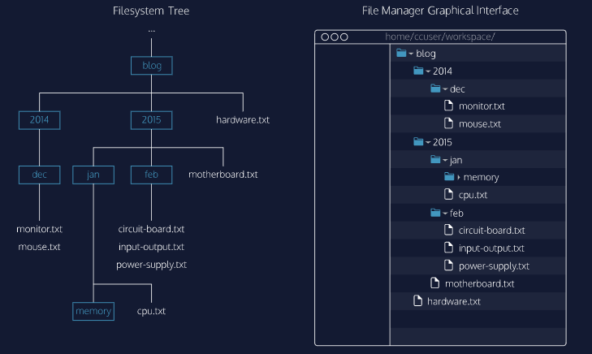

# Navigation

## Table of Contents 

- [Introduction](#Introduction)
- [Filesystem](#Filesystem)
- [ls](#ls)
- [pwd](#pwd)
- [cd](#cd)
- [mkdir](#mkdir)
- [touch](#touch)
- [Helper Commands](#Helper-Commands)
- [Review](#Review)


## Introduction 

The **command line** is a text interface for your computer. It is a program that takes in commands and passes them on to the computer’s operating system to run.

From the command line, we can navigate through files and folders on our computer, just as we would with Finder on Mac OS or Windows Explorer on Windows. The difference is that the command line is fully text-based.

The advantage of using the command line is its power. We can run programs, write scripts to automate common tasks, and combine simple commands to handle difficult tasks. All of these traits come together to make it an important programming tool.

This course is for unix-based systems such as Linux and Mac OS X. You can also download programs on Windows that will allow you to use the same commands. An appendix of all commands taught in this course is available [here](https://www.codecademy.com/articles/command-line-commands). 


## Filesystem

A filesystem organizes a computer’s files and directories into a tree structure:

1. The first directory in the filesystem is the *root directory*. It is the parent of all other directories and files in the filesystem.
2. Each parent directory can contain more child directories and files. In the filesystem below, **blog/** is the parent of **2014/**, **2015/**, and **hardware.txt**.
3. Each directory can contain more files and child directories. The parent-child relationship continues as long as directories and files are nested.




## ls

The first command we are going to look at is `ls`. A *command* is a directive to the computer to perform a specific task. When we type `ls`, the command line looks at the directory we are in, and then “lists” all the files and directories inside of it.

In the terminal, the first thing you see is `$`. This is called a *shell prompt*. It appears when the terminal is ready to accept a command.

If we typed:

```shell
$ ls
```

the terminal would display our current directory’s files and directories:

```shell
2014  2015  hardware.txt
```

The directories **blog**, **test**, and the file **index.js** are the contents of the current directory.


## pwd

The next command we are going to look at is `pwd`, which stands for “print working directory.” It outputs the name of the directory you are currently in, called the *working directory*.

Here the working directory is **blog/**. Together with `ls`, the `pwd` command is useful to show where we are in the filesystem.


## cd

Our next command is `cd`, which stands for “change directory.” Just as we would click on a folder in Windows Explorer or Finder, `cd` switches we into the directory you specify. In other words, `cd` changes the working directory.

Let’s say the directory we change into is **2015**:

```shell
$ cd 2015
```

When a file, directory, or program is passed into a command, it is called an *argument*. Here the 2015 directory is an argument for the `cd` command.

The `cd` command takes a directory name as an argument and switches into that directory.


Instead of using `cd` twice in order to move from **2015** to **memory**, we can use it once and give it a longer argument:

```shell
$ cd jan/memory
```

To navigate directly to a directory, use `cd` with the directory’s path as an argument. Here, `cd jan/memory` navigates directly to the **memory** directory.

To move up one directory, we use `cd ..`:

```shell
$ cd ..
```

Here, `cd ..` navigates up from **jan/memory/** to **jan/**. 

```shell
$ cd ../2014
```

The command above will move to **2014/**. 

```shell
$ cd ../..
```

The command above will move the current working directory up two levels. 


## mkdir

Now that we can traverse the existing filesystem, let’s try editing it by making directories (folders) through the command line. The command for that is `mkdir`:

```shell
$ mkdir media
```

The `mkdir` command stands for “make directory”. It takes in a directory name as an argument and then creates a new directory in the current working directory.

Here we used `mkdir` to create a new directory named **media/** inside our working directory.

```shell
$ mkdir media/tv
```

The command above creates a new directory named **tv** inside **media**. 


## touch

Now we know how to create directories through the command line, now let's find out how to create new files?

We can do this using the command `touch`:

```shell
$ touch keyboard.txt
```

The `touch` command creates a new file inside the working directory. It takes in a filename as an argument and then creates an empty file with that name in the current working directory.

Here we used `touch` to create a new file named **keyboard.txt**.

We could also do something like: 

```shell
$ touch media/popular.txt
```


## Helper Commands

Now that we have covered the basics of navigating your filesystem from the command line, let’s look at some helpful commands that will make using it easier!

`clear` is used to clear your terminal, which is useful when it is full of previous commands and outputs. It does not change or undo our previous commands, it just clears them from the view. We can scroll upwards to see them at any time.

**tab** can be used to autocomplete your command. When we are typing the name of an existing file or directory, we can use tab to finish the rest of the name.

The up and down arrows (↑ and ↓) can be used to cycle through our previous commands. ↑ will take us up through our most recent commands, and ↓ will take us back through to the most recent one.


## Review

- The *command line* is a text interface for the computer’s operating system. To access the command line, we use the terminal.
- A *filesystem* organizes a computer’s files and directories into a tree structure. It starts with the *root directory*. Each parent directory can contain more child directories and files.
- From the command line, we can navigate through files and folders on your computer:
  - `pwd` outputs the name of the current working directory.
  - `ls` lists all files and directories in the working directory.
  - `cd` switches us into the directory you specify.
  - `mkdir` creates a new directory in the working directory.
  - `touch` creates a new file inside the working directory.
- We can use helper commands to make navigation easier:
  - `clear` clears the terminal
  - tab autocompletes the name of a file or directory
  - ↑ and ↓ allow you to cycle through previous commands